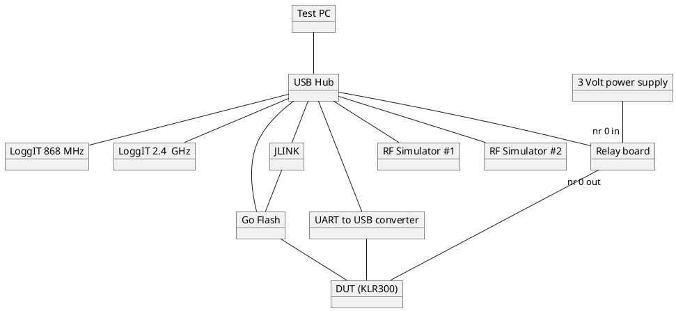

# PlantUml in MarkDown

```plantuml
@startuml
'-------------------------------------------------------------------------------
' Please install Markdown Diagrams plugin it your browser,
' in order to Render PlantUML, Mermaid and others graph/diagrams on webpages!
'-------------------------------------------------------------------------------
object "Test PC" as testpc
object "USB Hub" as usbhub
object "LoggIT 868 MHz" as loggit1
object "LoggIT 2.4  GHz" as loggit2
object "Go Flash" as goflash
object "UART to USB converter" as ft230
object "JLINK" as jlink
object "DUT (KLR300)" as dut
object "RF Simulator #1" as rfsim1
object "RF Simulator #2" as rfsim2
object "Relay board" as relay
object "3 Volt power supply" as power
testpc -- usbhub
usbhub -- goflash
goflash -- dut
usbhub -- loggit1
usbhub -- loggit2
usbhub -- ft230
ft230 -- dut
usbhub -- jlink
jlink -- goflash
usbhub -- rfsim1
usbhub -- rfsim2
usbhub -- relay
relay "nr 0 out" -- dut
power -- "nr 0 in" relay
@enduml
```

